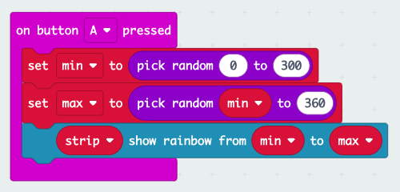

# 🌟 Microbit Pixel Lights Adventure! 🌈

## Let's Get Started!

### Step 1: Plug In Your Microbit

-   Find a **micro-USB cable** and connect your Microbit to your computer. It's like giving your Microbit a little high-five! ✋

### Step 2: Enter the World of Code

-   Click this magic link to go to MakeCode Blocks Editor: [makecode microbit](https://chat.openai.com/c/makecode.microbit.org). It's like our secret portal to fun coding!

### Step 3: Discover New Extensions

-   Click on ‘Extensions’ in the editor. It's like opening a treasure chest of cool tools! 🏴‍☠️

### Step 4: Search for Neopixel

-   In the search bar, type ‘neopixel’ like a code detective 🔍, and then choose the ‘neopixel’ box that pops up.

### Step 5: Create Magic with Code

-   Now let’s make some coding magic! Follow this code to get started:
    
    
    

### Step 6: Color the Lights with Button A

-   Press button A to make your LEDs light up in awesome colors! 🌈
    
    
    

### Step 7: Clear the Lights with Button B

-   If you press button B, it’s like using a magic eraser to clear the colors! ✨
    
    

### Step 8: Try add radio communication on top

-   Broadcast your idea to nearby friends

    

### Step 9: More fun to play with

-   Fancy other games? Follow the links [here](https://makecode.microbit.org/examples)